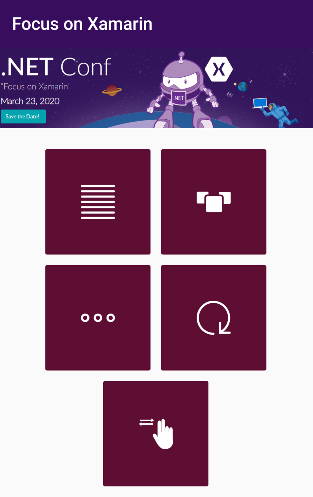
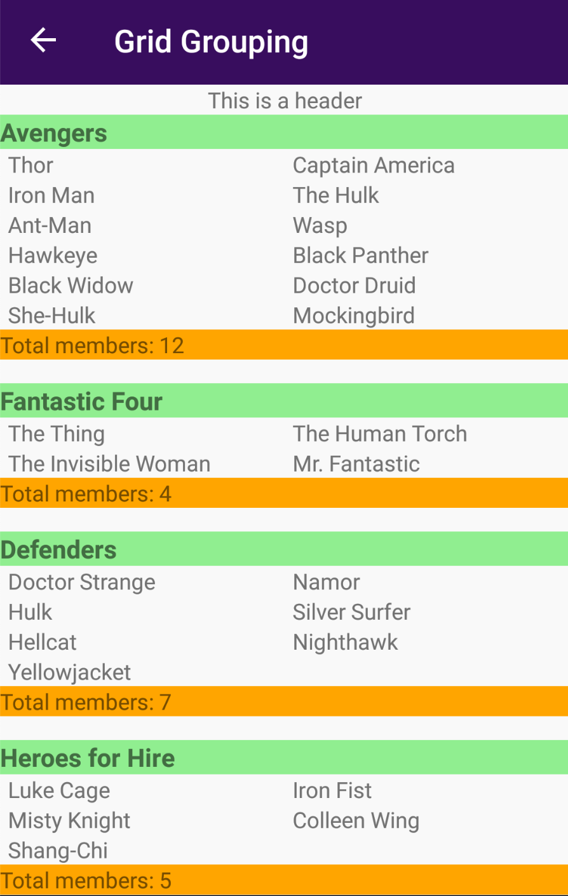
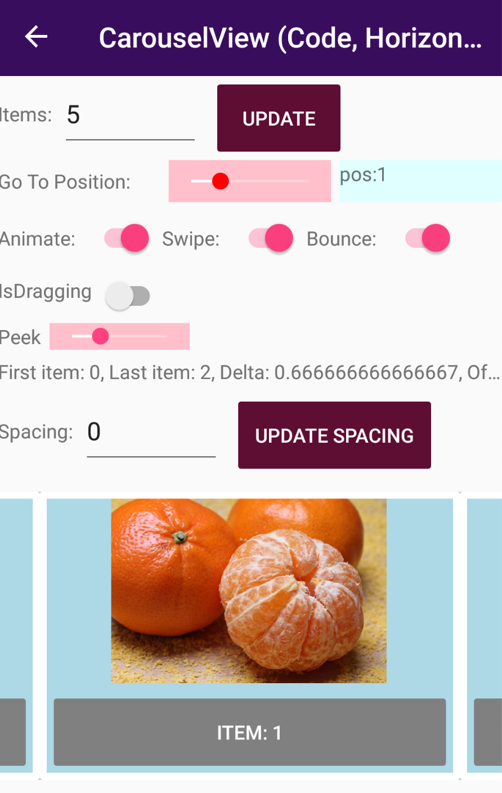
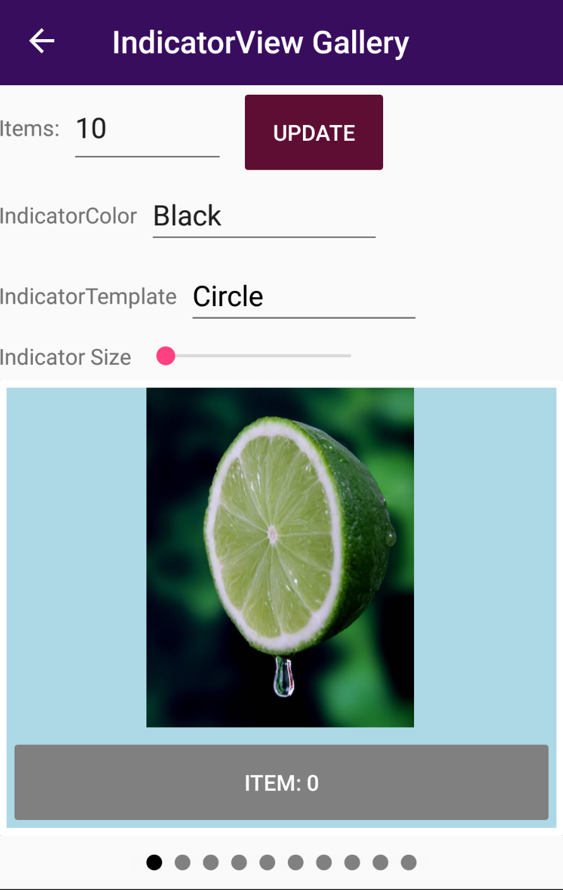
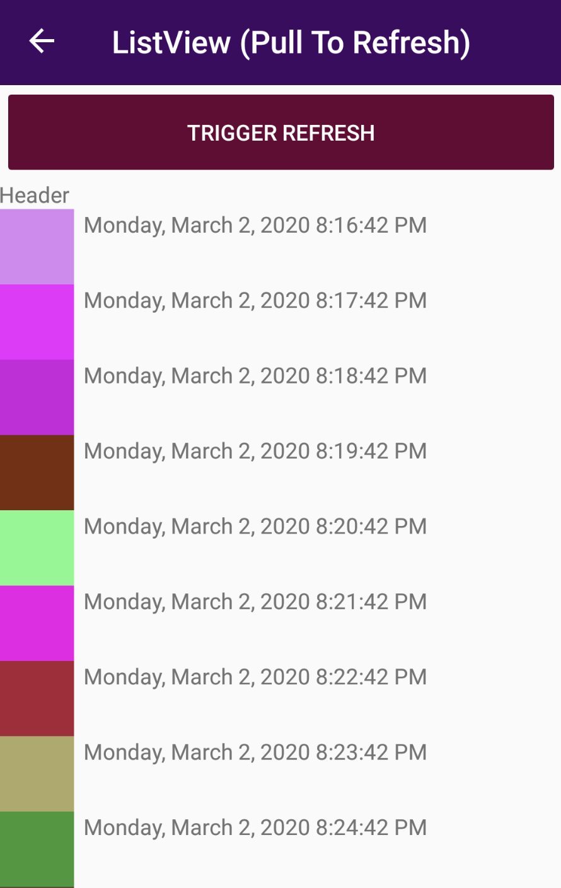
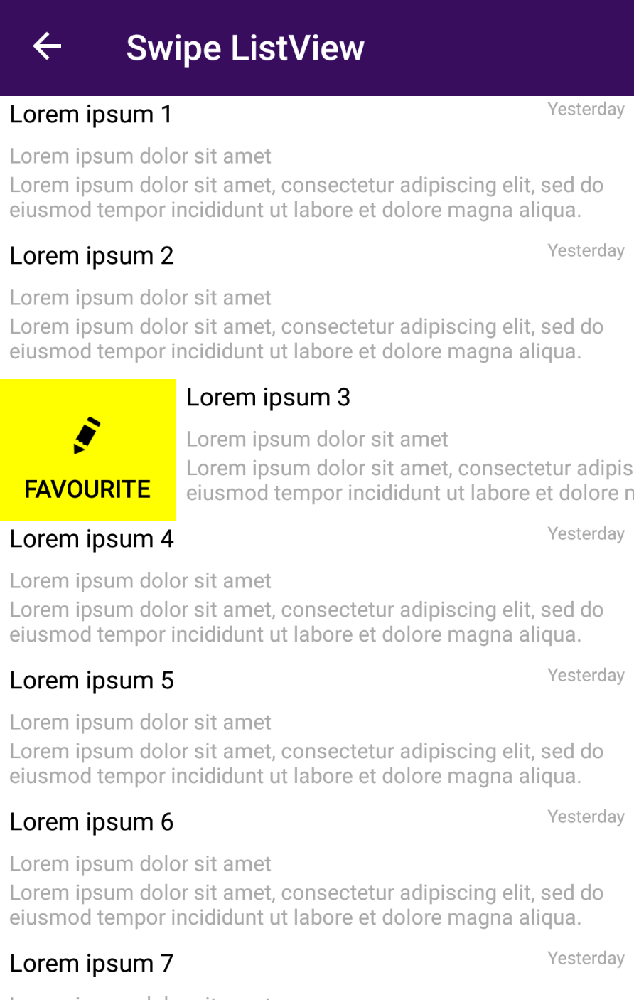

# Focus on Xamarin

CollectionView, CarouselView, IndicatorView, RefreshView and SwipeView demos used in the "Visualize Your Data (CollectionView, CarouselView, & Beyond)" [Focus on Xamarin](https://focus.dotnetconf.net/agenda) event session.

     

## Related Xamarin.Forms goodlooking UI samples 

* [DrinksGalleryApp](https://github.com/jsuarezruiz/DrinksGalleryApp): Xamarin.Forms goodlooking UI sample using the new CarouselView (Parallax).
* [FavFighters](https://github.com/jsuarezruiz/FavFighters): Xamarin.Forms goodlooking UI sample using the SwipeView. 
* [FoodDeliveryDuo](https://github.com/jsuarezruiz/FoodDeliveryAppDuo): Xamarin.Forms good looking UI sample for Surface Duo using CarouselView, CollectionView, IndicatorView, etc.
* [FlightBookingApp](https://github.com/jsuarezruiz/FlightBookingApp): Xamarin.Forms goodlooking UI sample using the SwipeView. 

  

## Copyright and license

Code released under the [MIT license](https://opensource.org/licenses/MIT).